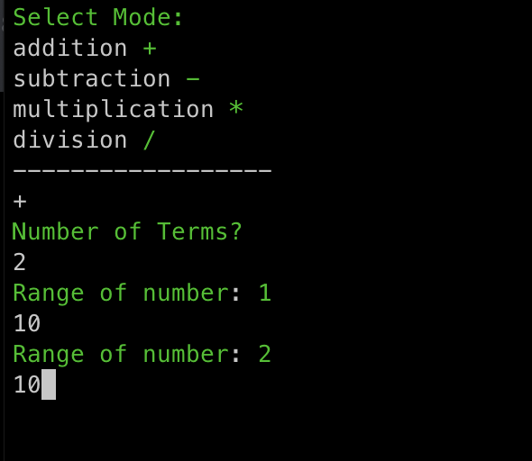
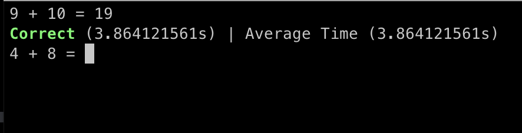
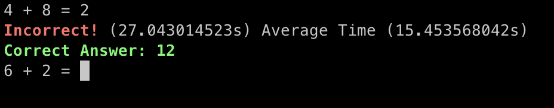
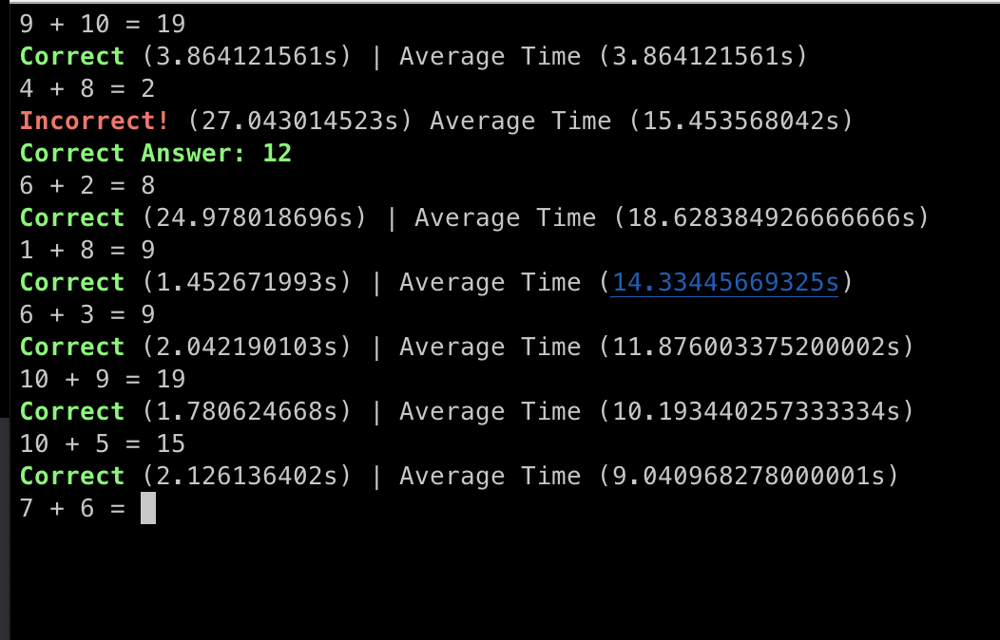

# Memocalc

**Version:** v1.0.0

A useful tool for practicing mental mathematics.

## Features

- Helps you practice mental math problems
- Basic arithmetic, (addition, subtraction, multiplication, division)
- Customizability
- Many different modes / challenges
- Easy to use, and fast

## About

**Memocalc** is a useful tool for practicing mental math. The software is highly **customizable**, with customizability for the **amount of terms**, and **range** that each term should have. Mentical has many different **modes** and **challenges**, making practicing mental math all the more **fun**. We also track the **time** you took for each problem, to help you **improve** your speed.

### **More detail on how it works**

You will be given a prompt, to choose which **sign** you would like to practice. Then, you will be told to select an amount of **terms**, and for each term you chose, you will be provided with a prompt to select the **range**. Memocalc will automatically generate problems for you, based on the **amount of terms** you selected, and each term will be **between the range** of what you selected.

- **[Examples](#Examples)**
- **[Release notes](#Planned-v2-changes)**

## Installation

### Binaries

Binaries for Windows, MacOS, and Linux can be downloaded, and installed.

Check **assets** under [releases](https://github.com/mathical-rs/mentical/releases/latest) to find the correct binaries for your system.

### Package Managers

**[Homebrew](https://brew.sh/)** (MacOS)

```bash
brew tap memomath/homebrew-brew
brew install memocalc
```

**[Scoop](https://scoop.sh)** (Windows)

```bash
scoop install memocalc
```

Source build using **[Cargo](https://crates.io/crate/memocalc)**

```bash
cargo install memocalc
```

## Examples

**Initial Prompt**
<br>


**Examples**
<br>




## Upcoming version plans

### Planned v2 Changes

**Features**

- Timed test - set the time for the test, solve problems within that time, and print out calculated average speed
- Exponent problems
- Un-hardcode the help command

**Bugs**

- Round timestamps for time + average time
- Fix bug where spamming answers sets time around 400s

### Planned v3 Changes

(so I don't forget)

**Features**

- Equation parser
- Simple equation problems

**Bugs**
